# Image Generation Log — The Sandwich Spot, Palm Springs

Build date: **2026-04-28** (PRO-MAX mode, two-direction build)

---

### #1 — d1-sandwich-stretcher.jpg
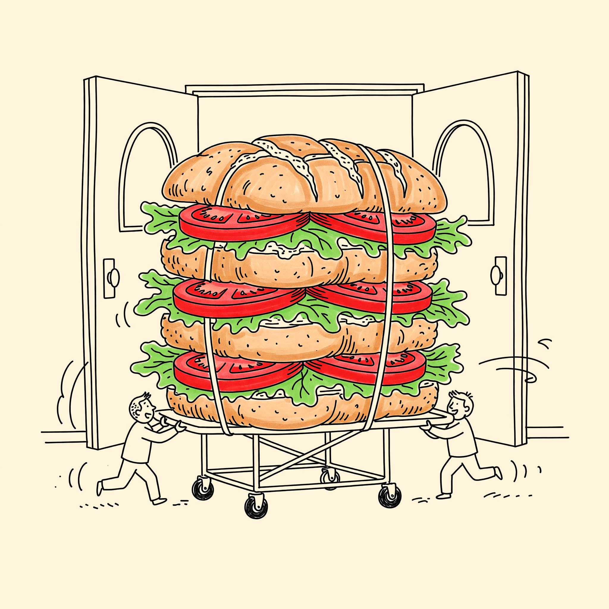
- **Timestamp**: 2026-04-28 19:03
- **Tier**: 1 | **API**: Grok Standard 2K | **Cost**: $0.02
- **Exec time**: 13s
- **Slot**: Direction A hero centerpiece + Direction A's selector card visual + index OG composition
- **Aspect**: 1:1 · 2048×2048 · 3.5MB
- **Prompt**: "[style lock]. A heroic four-tiered Dutch Crunch sandwich strapped to a hospital stretcher with rolling wheels, two tiny EMT figures rushing it through swinging emergency room doors. The sandwich has tomato slices and lettuce poking out comically. Motion lines suggest urgency. Composition: full subject centered, slightly low angle, single-weight black ink, loose confident strokes."
- **Claude review**: Use Case 9/10 | Prompt Accuracy 7/10 — color was forbidden in original style lock but Grok added warm color fills (tomato red, lettuce green, bread tan); the colored output is actually stronger for this brand than strict B&W and matches the planned palette.
- **Status**: ✓ Used. Style decision triggered: updated style lock for remaining 11 prompts to permit warm flat color fills.
- **Notes**: Pivotal image — the hero of Direction A. Sets the visual vocabulary for the entire doodle set.

---

### #2 — d2-rotary-phone.jpg
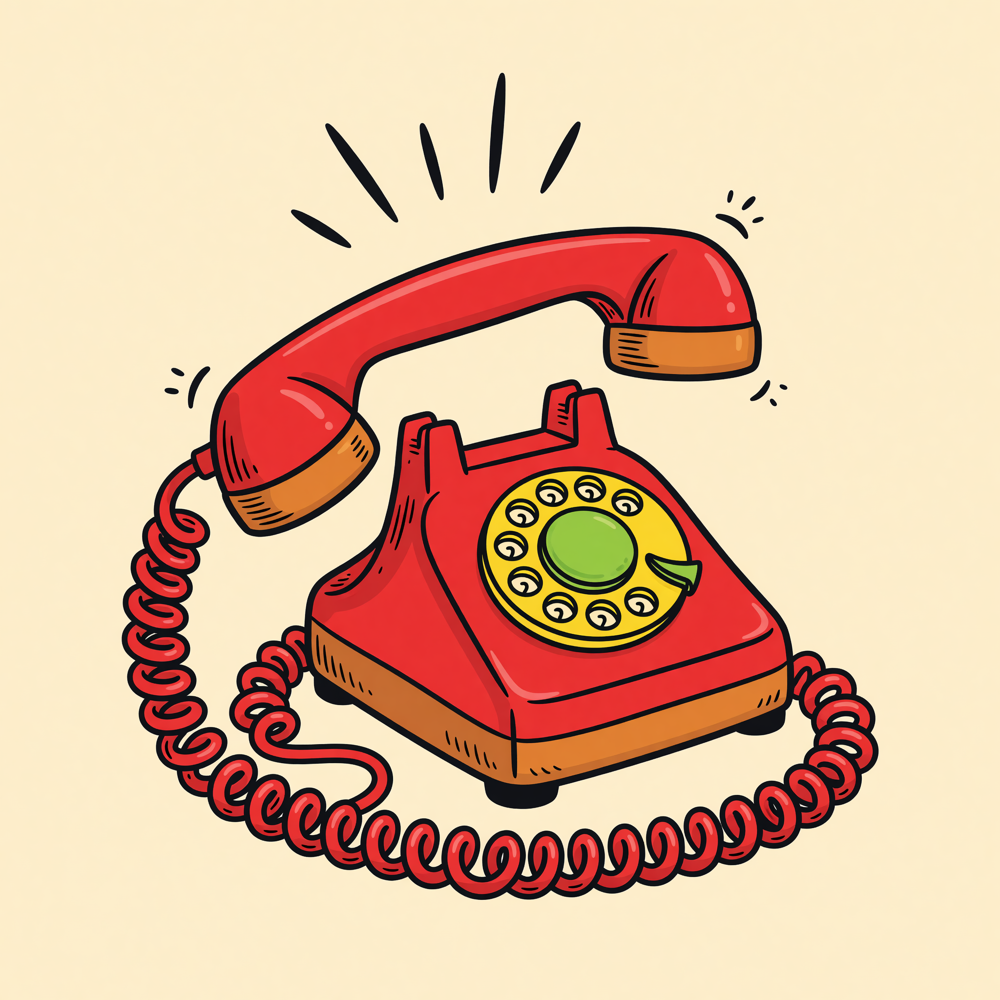
- **Timestamp**: 2026-04-28 19:05
- **Tier**: 1 | **API**: Grok Standard 2K | **Cost**: $0.02
- **Exec time**: 5s
- **Slot**: Direction A hero secondary doodle (paired with the sandwich-stretcher)
- **Aspect**: 1:1 · 2048×2048 · 2.6MB
- **Prompt**: "[updated style lock]. A 1950s rotary telephone in candy red, receiver lifted off the cradle, a curling phone cord swirling underneath. Above the receiver, three radiating sound waves with small motion marks. The phone tilted slightly five degrees to the right."
- **Claude review**: Use Case 10/10 | Prompt Accuracy 10/10
- **Status**: ✓ Used
- **Notes**: First image generated under the updated colored style lock. Confirms the color vocabulary holds across the set.

---

### #3 — d3-doctor-dena.jpg

- **Timestamp**: 2026-04-28 19:06
- **Tier**: 1 | **API**: Grok Standard 2K | **Cost**: $0.02
- **Exec time**: 8s · 1 retry needed (4:5 aspect ratio rejected, retried with 3:4)
- **Slot**: Direction A "A note from the kitchen" mid-page strip — recurring "Doctor Dena" character
- **Aspect**: 3:4 · ~1.7K×2.3K · 4.5MB
- **Prompt**: "[style lock]. A friendly middle-aged woman character with shoulder-length dark hair, wearing a white deli apron, a white paper hat, and a doctor stethoscope around her neck. She is holding up a Dutch Crunch sandwich to the light like a doctor reading an X-ray, eyes squinted thoughtfully, kind warm smile, laugh lines around her eyes. Bust-up framing, three-quarter angle, expressive cartoon face. She must look approachable and matronly, like a beloved local mom-and-pop owner, not clinical or sterile. Tomato red apron stripes, mustard yellow stethoscope tubing."
- **Claude review**: Use Case 10/10 | Prompt Accuracy 9/10 (stethoscope ended up tomato red instead of mustard yellow — minor; output is on-brand)
- **Status**: ⏸ Replaced 2026-04-29 with a Daddy-supplied likeness that better resembles the real Dena. Original AI doodle preserved at `images/d3-doctor-dena-archived-doodle.jpg`. Same composition/palette/style — alt text on both V1 and V2 still describes it accurately.
- **Notes**: The character anchors Direction A's "Doctor Dena" annotations through the menu. **Lesson**: Grok rejects `4:5`; valid ratios are `1:1, 3:4, 4:3, 9:16, 16:9, 2:3, 3:2, 9:19.5, 19.5:9, 9:20, 20:9, 1:2, 2:1, auto`. Updated the brief.

---

### #4 — d4-fedora-martini.jpg
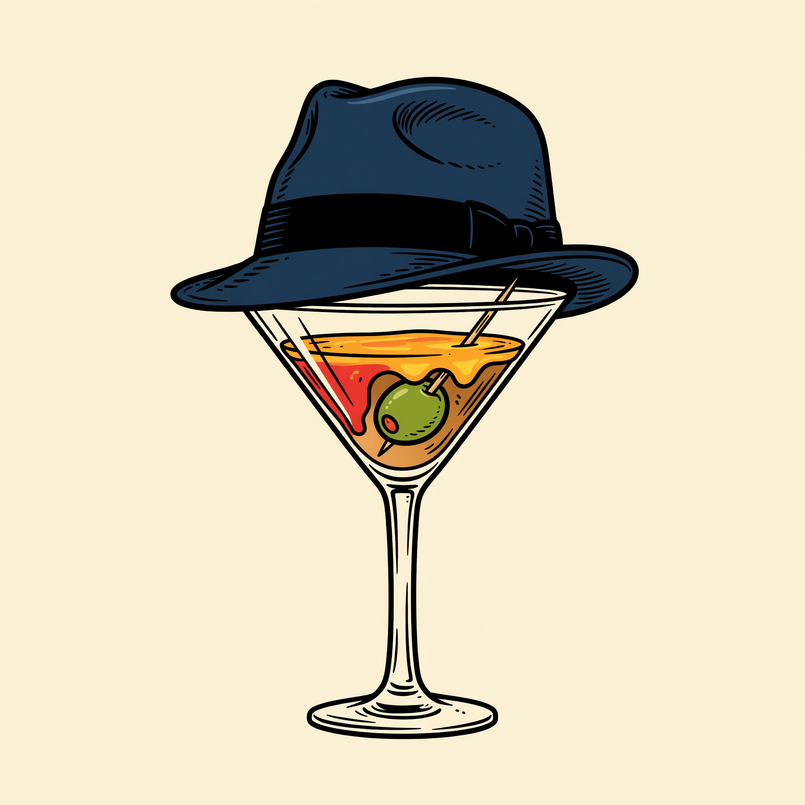
- **Timestamp**: 2026-04-28 19:07
- **Tier**: 1 | **API**: Grok Standard 2K | **Cost**: $0.02
- **Exec time**: 5s
- **Slot**: Direction A menu accent (between sandwiches #2 and #3 — Sinatra's "Chairman of the Board"), Direction B's polaroid hero margin doodle
- **Aspect**: 1:1 · 1.4MB
- **Prompt**: "[style lock]. A 1960s Rat Pack-era classic mens fedora hat in dark navy blue with a black hatband, resting on top of a classic V-shaped martini glass with a green olive on a wooden toothpick, a clear stemmed cocktail glass."
- **Claude review**: Use Case 10/10 | Prompt Accuracy 10/10
- **Status**: ✓ Used in both directions

---

### #5 — d5-tennis-racket.jpg
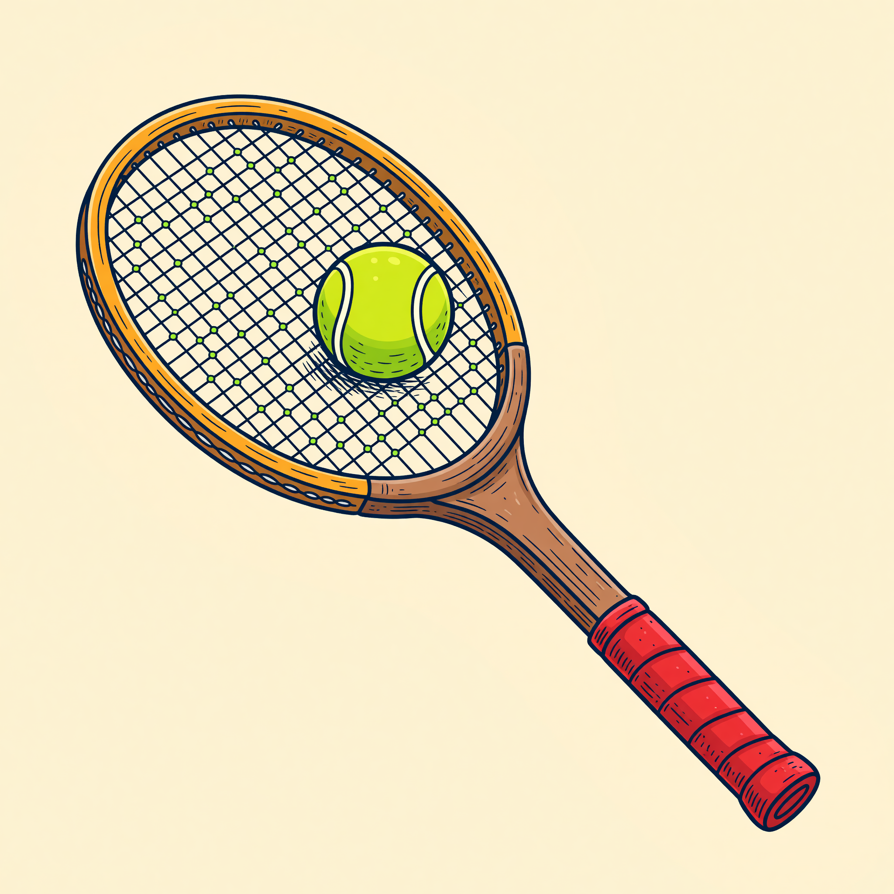
- **Timestamp**: 2026-04-28 19:08
- **Tier**: 1 | **API**: Grok Standard 2K | **Cost**: $0.02
- **Exec time**: 6s
- **Slot**: Direction A menu accent (after #10), Direction B's "Tennis Royalty" polaroid (caption: "stand 19. love-all.")
- **Aspect**: 1:1 · 2.4MB
- **Prompt**: "[style lock]. A vintage wooden tennis racket with brown wood frame, laced strings shown as a crisscross grid, oval head, leather grip wrapped in tomato red. The racket leaning at a 30 degree angle. A neon yellow-green tennis ball with curved white seams resting in the sweet spot of the strings."
- **Claude review**: Use Case 10/10 | Prompt Accuracy 10/10
- **Status**: ✓ Used in both directions

---

### #6 — d6-thighmaster.jpg
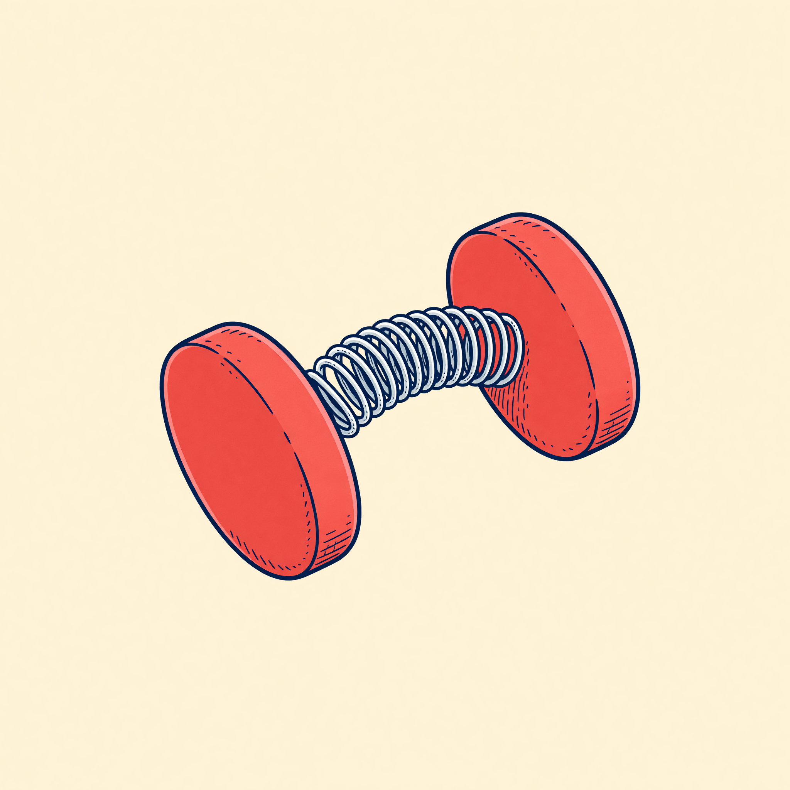
- **Timestamp**: 2026-04-28 19:09
- **Tier**: 1 | **API**: Grok Standard 2K | **Cost**: $0.02
- **Exec time**: 6s
- **Slot**: Direction A menu accent (after #22)
- **Aspect**: 1:1 · 1.6MB
- **Prompt**: "[style lock]. A 1980s Thighmaster exercise device shaped like a butterfly hinge — two oval padded grips made of bright tomato-red foam, connected by a curved silver metal coil spring. Drawn from a three-quarter angle with the spring slightly compressed in the middle."
- **Claude review**: Use Case 8/10 | Prompt Accuracy 8/10 — recognizable as a Thighmaster but slightly resembles a dumbbell at first glance
- **Status**: ✓ Used (placement in menu provides context)

---

### #7 — d7-golf-club.jpg
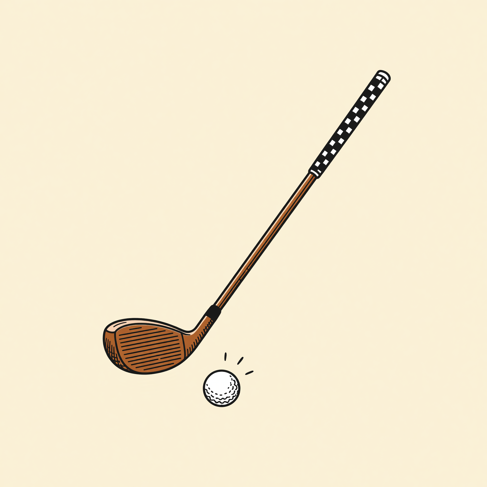
- **Timestamp**: 2026-04-28 19:10
- **Tier**: 1 | **API**: Grok Standard 2K | **Cost**: $0.02
- **Exec time**: 5s
- **Slot**: Direction A menu accent (after #18 Royal Hawaiian), Direction B's "Rat Pack & Riviera" polaroid (caption: "bob hope's tee box.")
- **Aspect**: 1:1 · 1.1MB
- **Prompt**: "[style lock]. A vintage classic wooden golf driver club with a dark brown wood head, a checkered black-and-white grip on the handle, resting at a 45 degree angle. A small white golf ball with dimples just below the club face, with three short curved motion lines suggesting the ball was just struck."
- **Claude review**: Use Case 10/10 | Prompt Accuracy 10/10
- **Status**: ✓ Used in both directions

---

### #8 — d8-dutch-crunch-infographic.jpg
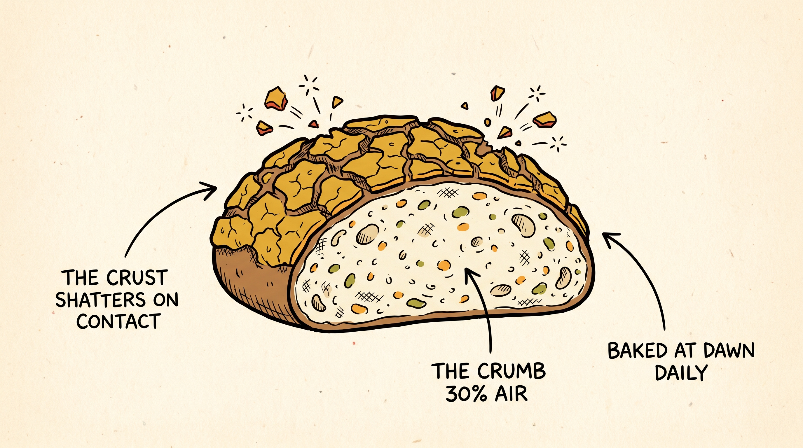
- **Timestamp**: 2026-04-28 19:13
- **Tier**: 2 | **API**: Gemini Nano Banana Pro 2K | **Cost**: $0.134
- **Exec time**: 32s
- **Slot**: Direction B "A Field Guide" Dutch Crunch deep-dive (showstopper element of Direction B)
- **Aspect**: 16:9 · 2.8MB
- **Prompt**: "[style lock — modified to allow text labels]. A side-view cross-section diagram of a Dutch Crunch loaf cut in half. The crust is drawn with a textured cracked tortoise-shell pattern in mustard yellow. The crumb shows small airy holes inside in cream color. Three thin black callout arrows fan out from the loaf to handwritten labels: (1) THE CRUST · shatters on contact (2) THE CRUMB · 30% air (3) BAKED AT DAWN · daily. All text in clean handwritten capital letters."
- **Claude review**: Use Case 10/10 | Prompt Accuracy 10/10 — perfectly rendered all 3 callouts, even added flying crumb particles to illustrate "shatters on contact"
- **Status**: ✓ Used
- **Notes**: This is the showstopper of Direction B. NB Pro's text rendering was flawless on the first attempt, justifying the tier escalation.

---

### #9 — d9-wish-you-were-here.jpg
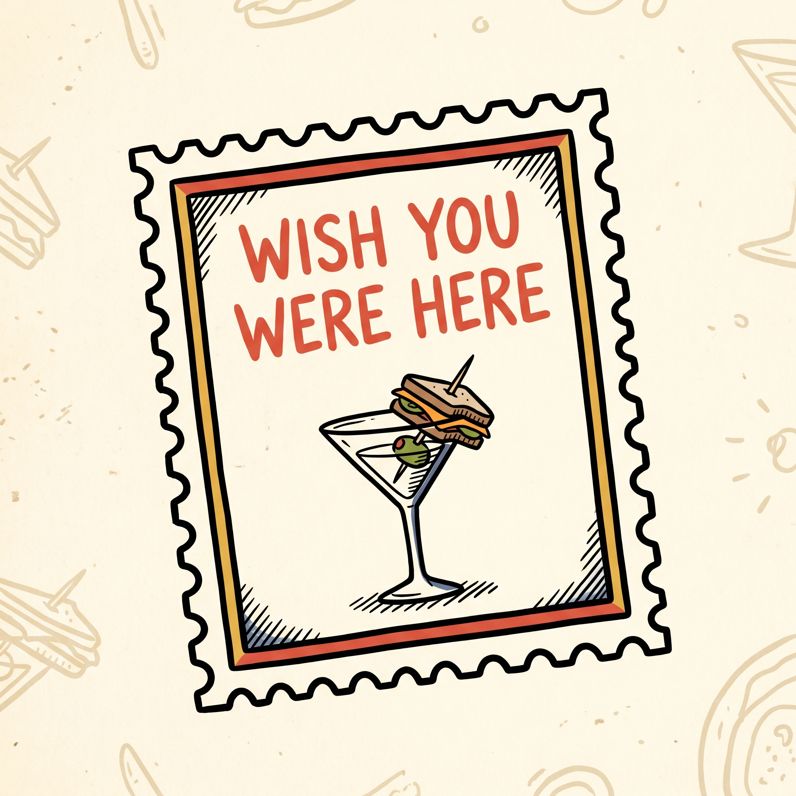
- **Timestamp**: 2026-04-28 19:15
- **Tier**: 2 | **API**: Gemini Nano Banana Pro 2K | **Cost**: $0.134
- **Exec time**: 26s
- **Slot**: Direction B postcard hero stamp + magazine-cover hero stamp + index selector card B
- **Aspect**: 1:1 · 2.5MB
- **Prompt**: "[style lock]. A vintage rectangular postcard postage-stamp design with perforated zigzag edges. Inside the stamp at the top, the words \"WISH YOU WERE HERE\" rendered in clean handwritten block capital letters in tomato red. Below the text, a tiny doodle of a classic V-shaped martini glass with a sandwich speared on the toothpick instead of an olive."
- **Claude review**: Use Case 10/10 | Prompt Accuracy 10/10 — text rendered cleanly in tomato red, perforated edges perfect, sandwich-on-toothpick joke landed
- **Status**: ✓ Used
- **Notes**: Bonus — NB Pro added a subtle pattern of additional doodle ghosts in the cream background that adds character.

---

### #10 — d10-palm-mountains.jpg
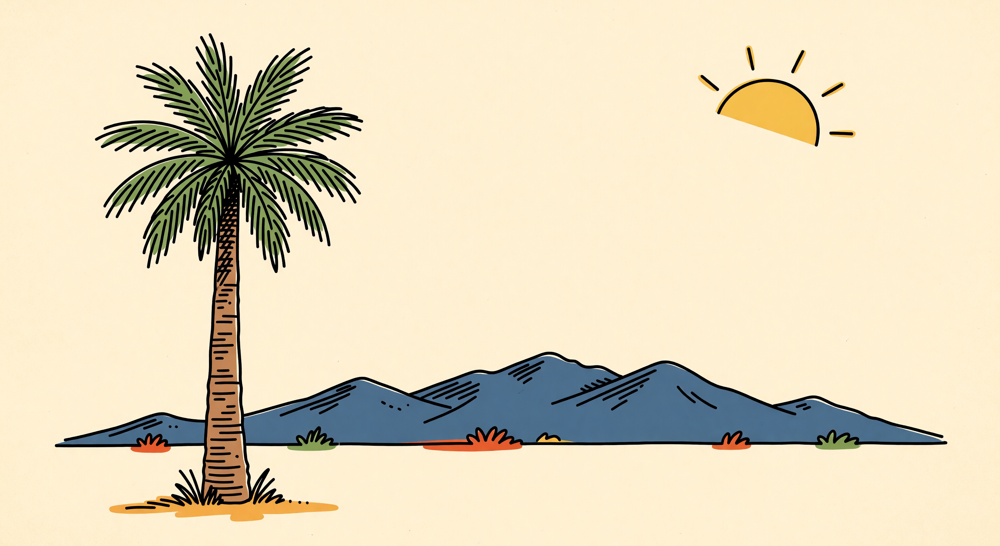
- **Timestamp**: 2026-04-28 19:11
- **Tier**: 1 | **API**: Grok Standard 2K | **Cost**: $0.02
- **Exec time**: 7s
- **Slot**: Direction B postcard frame background + Direction B's selector card + index OG right half
- **Aspect**: 16:9 · 2752×1504 · 4.0MB
- **Prompt**: "[style lock]. A single tall California fan palm tree on the left third of the frame, brown trunk drawn with horizontal hatch marks, fronds drawn loosely as splayed strokes in pickle green. Behind it, the silhouette of the San Jacinto Mountains as simple jagged peaks in dusty navy blue, stretching across the horizon. A rising sun (just an arc with three short rays) in the upper right corner in mustard yellow."
- **Claude review**: Use Case 10/10 | Prompt Accuracy 10/10 — got the iconic Palm Springs landscape exactly right
- **Status**: ✓ Used in 3 places

---

### #11 — d11-map-sketch.jpg
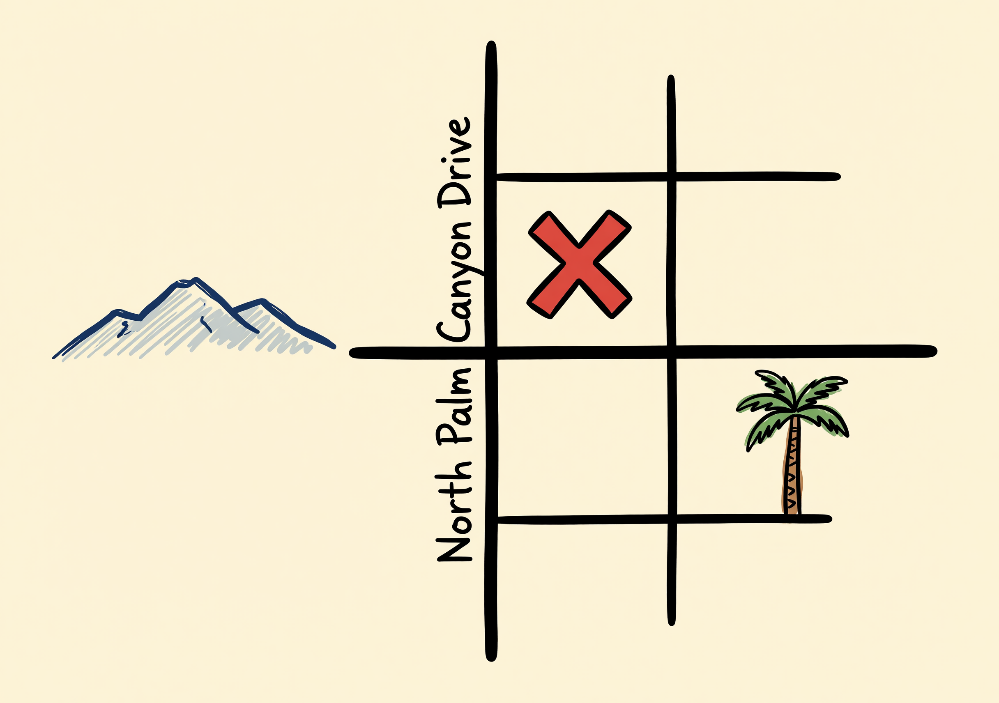
- **Timestamp**: 2026-04-28 19:11
- **Tier**: 1 | **API**: Grok Standard 2K | **Cost**: $0.02
- **Exec time**: 6s
- **Slot**: Direction A "Find us" location section
- **Aspect**: 4:3 · 1.4MB
- **Prompt**: "[style lock]. A loose hand-drawn pirate-treasure-map style street grid of downtown Palm Springs. North Palm Canyon Drive running vertically down the center. Two cross streets crossing it. A bold tomato-red letter X on one block in the middle. A small palm tree doodle in one corner. A small mountain range silhouette on the left edge."
- **Claude review**: Use Case 10/10 | Prompt Accuracy 10/10 — even rendered "North Palm Canyon Drive" text legibly along the street, which was a stretch goal for Grok
- **Status**: ✓ Used
- **Notes**: Surprise win — Grok rendered street-label text correctly despite being a non-text-model use case.

---

### #12 — d12-mid-bite.jpg
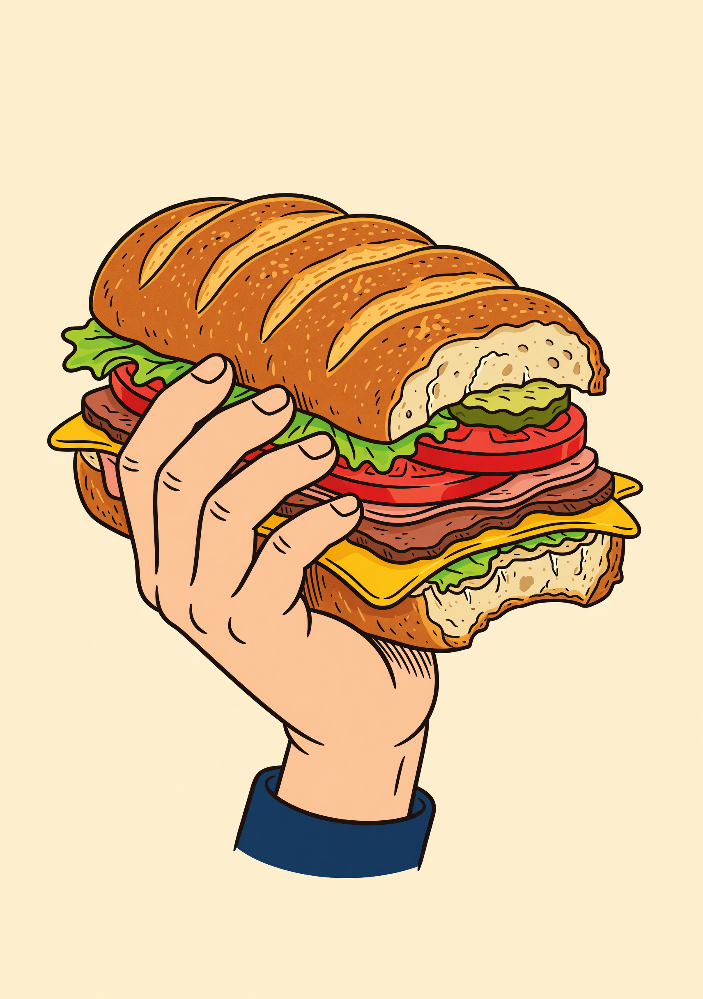
- **Timestamp**: 2026-04-28 19:12
- **Tier**: 1 | **API**: Grok Standard 2K | **Cost**: $0.02
- **Exec time**: 6s
- **Slot**: Reserved for future use (could replace D1 in alt hero, or be added as a menu accent)
- **Aspect**: 3:4 · 2.6MB
- **Prompt**: "[style lock]. A human hand from the wrist up holding a giant Dutch Crunch sandwich, one bite already taken out of the side of the sandwich (visible jagged tooth marks on the bread). The sandwich layers visible at the bite — Dutch Crunch crust top, lettuce, red tomato slice, brown sliced meat, more bread."
- **Claude review**: Use Case 9/10 | Prompt Accuracy 10/10
- **Status**: ✓ Generated · ⏸ Not currently placed in either mockup (kept as deck spare for future variants)

---

## Total cost — under cap

| Tier | Count | Per-image | Subtotal |
|---|---:|---:|---:|
| Grok Standard 2K | 10 | $0.020 | **$0.200** |
| Gemini Nano Banana Pro 2K | 2 | $0.134 | **$0.268** |
| **Build total** | **12** | | **$0.468** |

Build cap was $0.75 — landed at **62% of cap**. No retries needed (every image accepted on first attempt). No QA failures.

## Cost notes
- Grok's color override on D1 redefined the style lock and removed the need for a regeneration — net saving.
- NB Pro's text-rendering reliability paid off: zero text-correction edits needed on D8 or D9.
- D12 was generated as a hedge but didn't land in either build — keep for v2.
- OG composites and favicon were generated locally with PIL ($0).

## Key learnings for next build
1. Grok's aspect-ratio enum doesn't include `4:5` — use `3:4` for portraits.
2. Style locks that ask for "no color" tend to be ignored by Grok — the model defaults to its illustration training distribution. Either accept that or escalate to NB2 where prompt-following is tighter.
3. NB Pro produced the only two text-bearing doodles flawlessly on first attempt at $0.134 each — text-heavy slots are not the place to economize on Grok.
